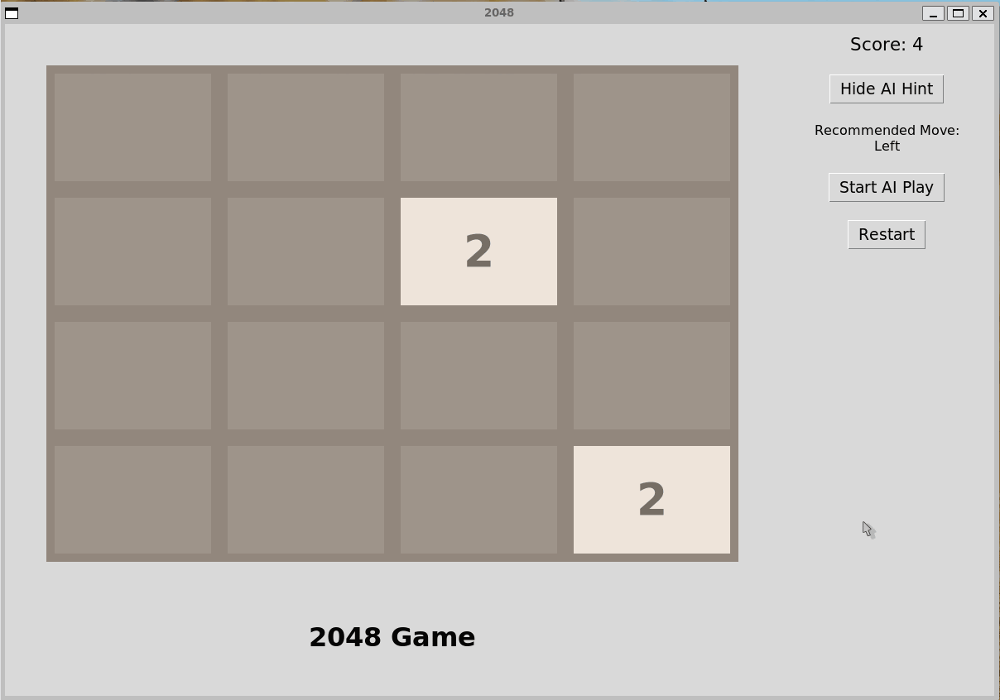

2048 Python
===========

Based on the popular game [2048](https://github.com/gabrielecirulli/2048) by Gabriele Cirulli. The game's objective is to slide numbered tiles on a grid to combine them to create a tile with the number 2048. Here is a Python version that uses TKinter! 

To start the game, run:
    
    $ python3 puzzle.py

Added probability for placement of tiles (90% for 2 and 10% for 4)

Added AI autoplay feature to run through game

Added reveal hint feature to provide hint for which direction to move

Added restart button to start new game

---

**Folder Structure:**

---

root/
├── puzzle.py           # Main entry point for the game
├── logic.py            # Core game logic for tile movements and merging
├── constants.py        # Constants for board size, colors, fonts, and key mappings
├── ai_logic.py         # AI implementation
├── test_parallel.py    # Simulation Implementation
└── README.md           # Documentation

---

**File Descriptions:**
1. puzzle.py
*   **Purpose:** The main file for the game. It definies the graphical interface and handles all user interactions.
*   This file includes the GUI, game flow as well as buttons for our AI implementation

2. logic.py
3. constants.py
4. ai_logic.py
5. test_parallel.py
6. README.md